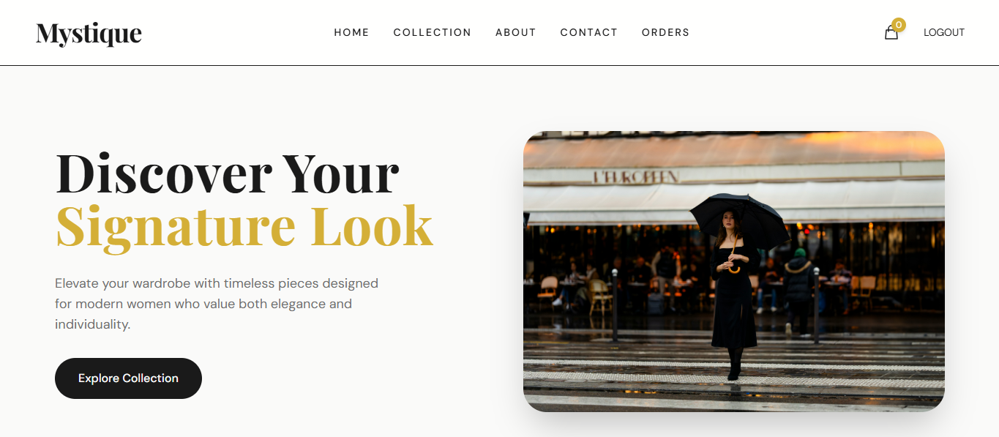

<!-- Hero Image -->
<p align="center">
  
</p>

<h1 align="center">✨ Mystique — Fashion eCommerce Platform ✨</h1>

<p align="center">
  <i>A sleek and responsive fashion-forward web platform built with the MERN stack.</i>
</p>

<p align="center">
  
  
  
</p>

---

## 🚀 Overview

Mystique is a modern full-stack eCommerce platform tailored for fashion lovers. With elegant product layouts, advanced filtering, user authentication, and a mobile-friendly interface, Mystique provides a seamless online shopping experience.

---

## 🖼️ Live Demo

👉 [Visit Live Site](https://mystique.vercel.app/)

---

## ✨ Features

- 🔥 Sleek UI/UX for immersive shopping
- 🛒 Product browsing with advanced filters
- 👤 Secure login/register with JWT
- ⚡ Admin panel for product & user management
- 📦 MongoDB for dynamic data storage
- 🎨 Responsive and optimized design

---

## 🔧 Tech Stack

| Frontend | Backend | Database | Styling | Deployment |
|----------|---------|----------|---------|------------|
| React.js | Node.js | MongoDB  | Tailwind CSS | Vercel / Render |
| Redux    | Express | Mongoose | Heroicons | MongoDB Atlas |

---

## 🖼️ UI Previews

<p align="center">
  
  <br/>
  
</p>

---

## 📂 Folder Structure
mystique/<br>
├── client/ # React frontend<br>
│ ├── components/<br>
│ ├── pages/<br>
│ └── ...<br>
├── server/ # Node.js backend<br>
│ ├── models/<br>
│ ├── routes/<br>
│ └── ...<br>
└── .env<br>


---

## 💻 Getting Started

### 🔧 Prerequisites

- Node.js
- MongoDB Atlas URI
- Vercel / Render account for deployment

### 🛠️ Installation

```bash
git clone https://github.com/Hammad-Tariq007/mystique.git
cd mystique
npm install
cd client
npm install
```
🔌 Environment Variables: <br>
Create a .env file in server/:
```bash
MONGO_URI=your_mongodb_uri
JWT_SECRET=your_jwt_secret
```
🚀 Run the App:
```bash
# In root directory
npm run dev
```

📈 Future Improvements:

🧾 Order management & payment integration

📧 Newsletter and email system

🌐 SEO enhancements

🤝 Contributing
Pull requests are welcome! For major changes, open an issue first to discuss what you’d like to change.

📜 License
MIT License

<p align="center"> Made with ❤️ by <a href="https://github.com/Hammad-Tariq007">Hammad Bin Tariq</a> </p> ```


